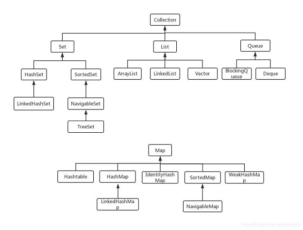
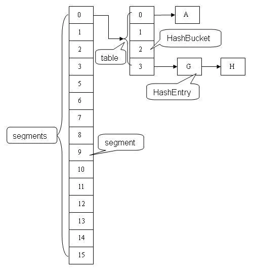
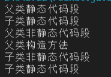

# Java后端

引文：

> [华为暑期实习java后端开发](https://www.nowcoder.com/discuss/434285)
>
> 


## 语言

### == 和 equals的区别 

==：

1. == 比较的是两个操作数时候是同一个对象，比较引用
2. 两边操作数必须是同一类型才能<u>编译通过</u>。
3. 比较的是地址，如果是具体的数字比较，值相等则为true。

```java
public class JavaEqual {
    public static void main(String[] args) {
        int a = 10;
        double b = 10;
        if(a==b){
            System.out.println("==");
        }
        else{
            System.out.println("!=");
        }
    }
}
// 输出: == 
```

equal：

1. equals比较两个对象的内容，如果没有进行重载，测试出的就是Object的equal方法，返回的就是==的判断。
2. String str = "hello"; 先在内存中找是不是有"hello"这个对象,如果有，就让str指向那个"hello".如果内存里没有"hello"，就创建一个新的对象保存"hello". String str=new String ("hello") 就是不管内存里是不是已经有"hello"这个对象，都新建一个对象保存"hello"。

```java
/**
String 类对equals的重写
*/
public boolean equals(Object anObject) {
    if (this == anObject) {
        return true;
    }
    if (anObject instanceof String) {
        String anotherString = (String)anObject;
        int n = count;
        if (n == anotherString.count) {
        char v1[] = value;
        char v2[] = anotherString.value;
        int i = offset;
        int j = anotherString.offset;
        while (n-- != 0) {
            if (v1[i++] != v2[j++])
            return false;
        }
        return true;
        }
    }
    return false;
    }
```

### >>> 与 >> 

`>>`带符号右移，高位根据数据正负，正补0，负补1

`>>>`无符号右移，高位补0

### String.split()

> [Java split()用法](https://www.cnblogs.com/xiaoxiaohui2015/p/5838674.html)

单个符号作为分割：

```java
String[] splitAddress=address.split("\\"); // `\`
String[] splitAddress=address.split("\\|"); // `|`
String[] splitAddress=address.split("\\*"); // `*`;`^`;`:`;`.`;`@`;`,` 同理，前面需要加\\
```

多符号作为分割：

> 如果使用多个分隔符则需要借助 | 符号，但需要转义符的仍然要加上分隔符进行处理

```java
String address="上海^上海市@闵行区#吴中路";
String[] splitAddress=address.split("\\^|@|#"); //分隔符为^ @ #
```


### Lambda表达式

不需要声明参数类型，编译器识别。

param -> { statements; }

```java
MathOperation addition = (int a, int b) -> a + b;

 interface MathOperation {
      int operation(int a, int b);
   }
```

某个方法的参数是函数式接口，可以用lambda表达式传入参数。

### 函数式接口

1. 有且仅有一个抽象方法，但是可以有多个非抽象方法的接口。
2. 可以被隐式转化为lambda表达式

### 集合有哪些

**Collection：** Set 、 List、 Queue

Queue：阻塞队列、双向队列

List：ArrayList、LinkedList、Vector

Set：HashSet<-LinkedHashSet、SortedSet<-NavigableSet<-TreeSet

**Map**：（Map不是集合）



### 

### HashMap底层源码问到底

Map <- AbstractMap <- HashMap

HashMap里有一个数组，计算hashcode，存入对应的数据位置。对于重复的元素采用链地址法，装在同一个数组下标的桶当中。

resize：每次resize都扩容为两倍。申请一个两倍的桶数组，将原先的记录逐个重新映射（重新计算hash）到新的桶里面，然后将原先的桶逐个置为null使得引用失效。 （**HashMap之所以线程不安全，就是resize这里出的问题**。）

HashMap线程不安全

> **WHY**：几种情况
>
> 1. put的时候，A、B两个线程，在Aput的时候获得了桶链表结尾的地址，这时候A时间片到了，B线程执行也需要put，也获取了最后的地址，将新的Node<K,V>插入到末尾。当A开始执行，他拥有的末尾地址还是旧的地址、不是最新的末尾节点。A进行put的时候就把B的数据给**覆盖**了。（1.8及之后的不安全所在）
>
> 2. get的时候会导致cpu100%。在resize的时候会造成**环形链表**。（1.8以前的，1.8及之后改用尾插入链表法，不会产生这个问题）
>
> 3. resize的时候会导致数据丢失（1.8以前的）
>
>    


ConcurrentHashMap解决线程安全问题，常用来做本地缓存

### ConcurrentHashMap在1.8中的底层，CAS原理，用啥锁，以及它在JDK1.7中的底层；

[ConcurrentHashMap底层实现原理(JDK1.7 & 1.8)](https://www.jianshu.com/p/865c813f2726)<br>

[Java基础之ConcurrentHashMap](https://www.jianshu.com/p/d0b37b927c48)

[HashMap？ConcurrentHashMap？相信看完这篇没人能难住你！](https://blog.csdn.net/weixin_44460333/article/details/86770169)


**1.7采用分段锁的机制**

理论上 ConcurrentHashMap 支持 CurrencyLevel (Segment 数组数量)的线程并发。每当一个线程占用锁访问一个 Segment 时，不会影响到其他的 Segment。

数据结构如下：




**1.8采用CAS+Synchronized来保证并发更新的安全**


**CAS**：

Compare and Swap(Set)，比较数据，如果没有改变说明没有冲突，替换成功。否则替换失败。


面试通常的套路是：

1. 谈谈你理解的 HashMap，讲讲其中的 get put 过程。（k-v存储的一个数据结构，然后能够较快的获取数据）（HashMap是链地址法，数组+链表的数据结构）

2. 1.8 做了什么优化？：采用了红黑树，避免hash碰撞严重导致查询缓慢

3. 是线程安全的嘛？：不是

4. 不安全会导致哪些问题？：1.7之前会导致死循环、数据丢失；1.8之后会导致数据覆盖

5. 如何解决？有没有线程安全的并发容器？：HashTable线程安全（效率低），ConcurrentHashMap。

6. ConcurrentHashMap 是如何实现的？ 1.7、1.8 实现有何不同？**为什么这么做**？

   + 1.7采用分段锁机制

   + 1.8采用CAS+Synchronized来保证并发更新的安全，同时采用红黑树来提高速度

   + 为什么8之后不用分段锁呢？
     + 分段锁的缺点：缺点在于分成很多段时会比较**浪费内存空间**(不连续，碎片化); 操作map时竞争同一个分段锁的概率非常小时，分段锁反而会造成**更新等操作的长时间等待**; 当某个段很大时，分段锁的性能会下降。[java8的ConcurrentHashMap为何放弃分段锁](https://cloud.tencent.com/developer/article/1509556)

   


### final修饰类、变量、方法

+ final修饰的类不能继承
+ final修饰的变量不能更改，只能复制一次。对于对象，该变量的**引用**不能更改！
+ final修饰的方法不能重写，但是可以继承。不能用于构造方法。

### **加载顺序**

父子类构造函数、静态代码段、非静态代码段调用顺序。

静态代码段 -> 非静态代码段 -> 构造函数（静态代码段优先除外，父类的初始化优先于子类的初始化）

```java
package Java_test;
public class ClassInitTest {
    public static void main(String[] args) {
        new Child();
    }
}
class Father {
    static {
        System.out.println("父类静态代码段");
    }
    { // 非静态代码段一定要用{}包裹
        System.out.println("父类非静态代码段");
    }
    public Father(){
        System.out.println("父类构造方法");
    }
}
class Child extends Father{
    static {
        System.out.println("子类静态代码段");
    }
    {
        System.out.println("子类非静态代码段");
    }
    public Child(){
        System.out.println("子类静态代码段");
    }
}
```




## 多线程

### java三种创建线程的方法

> 参考：
>
> [创建线程的三种方式_Callable和Runnable的区别](https://www.cnblogs.com/sunweiye/p/11023571.html)
>
> [浅谈线程runnable和callable的使用及区别](https://www.cnblogs.com/zyf-yxm/p/9959198.html)

**三种方法**

1. 通过实现Runnable接口
2. 通过继承Thread类
3. 通过Callable和Future创建线程

**Runnable和Callable异同**

相同：

+ 都是接口
+ 都可以用来编写多线程
+ 都需要Thread.start()启动

不同：

+ Callable接口的任务线程能返回执行结果，而Runnable接口的任务线程不能返回结果。
+ Callable接口的call方法允许抛出异常，而Runnable接口的run()方法只能在内部消化，不能抛出异常

注意：

​	Callable接口支持返回结果，需要通过FutureTast对象的get方法获得，需要阻塞主线程直到获取结果，不调用get则不会阻塞。

**Callable的优势**

​	多线程返回执行结果是一个很有用的特性，因为多线程相比单线程更难、更复杂的一个重要原因就是因为多线程充满着未知性，某条线程是否执行了？某条线程执行了多久？某条线程执行的时候我们期望的数据是否已经赋值完毕？无法得知，我们能做的只是等待这条多线程的任务执行完毕而已。而Callable+Future/FutureTask却可以获取多线程运行的结果，<u>可以在等待时间太长没获取到需要的数据的情况下</u>**取消**该线程的任务，真的是非常有用。


### 线程池参数

> 参考:
>
> [Java线程池使用和常用参数](https://www.cnblogs.com/owenma/p/8557074.html)
>
> 

**为什么要用线程池**

当我们需要的并发线程数量很多时，且每个线程执行很短的时间就结束了，这样，我们频繁的创建线程、销毁线程就大大降低了工作效率（创建与销毁线程需要时间和资源）。

java的线程池可以达到这样的效果，一个线程执行完任务后，继续执行下一个任务，不被销毁，这样线程的利用率就提高了。

**6个参数**

1、**corePoolSize**：核心线程数
        \* 核心线程会一直存活，及时没有任务需要执行
        \* 当线程数小于核心线程数时，即使有线程空闲，线程池也会优先创建新线程处理
        \* 设置allowCoreThreadTimeout=true（默认false）时，核心线程会超时关闭

​    2、**queueCapacity**：任务队列容量（阻塞队列）
​        \* 当核心线程数达到最大时，新任务会放在队列中排队等待执行

​    3、**maxPoolSize**：最大线程数
​        \* 当线程数>=corePoolSize，且任务队列已满时。线程池会创建新线程来处理任务
​        \* 当线程数=maxPoolSize，且任务队列已满时，线程池会拒绝处理任务而抛出异常

​    4、 **keepAliveTime**：线程空闲时间
​        \* 当线程空闲时间达到keepAliveTime时，线程会退出，直到线程数量=corePoolSize
​        \* *如果allowCoreThreadTimeout=true，则会直到线程数量=0*

    5、**allowCoreThreadTimeout**：允许核心线程超时
    6、**rejectedExecutionHandler**：任务拒绝处理器

+ 两种情况会拒绝处理任务:
  + 当线程数已经达到maxPoolSize，切队列已满，会拒绝新任务
  + 用shutdown()后，会等待线程池里的任务执行完毕，再shutdown。如果在调用shutdown()和线程池真正shutdown之间提交任务，会拒绝新任务
+ 线程池会调用rejectedExecutionHandler来处理这个任务。如果没有设置默认是AbortPolicy，会抛出异常
+ ThreadPoolExecutor类有几个内部实现类来处理这类情况：
     + AbortPolicy 丢弃任务，抛运行时异常
     + RunsPolicy 执行任务
     + DiscardPolicy 忽视，什么都不会发生
          dOldestPolicy 从队列中踢出最先进入队列（最后一个执行）的任务
     + 实现RejectedExecutionHandler接口，可自定义处理器

**ThreadPoolExecutor执行顺序**

线程池按以下行为执行任务
    1. 当线程数小于核心线程数时，创建线程。
        2. 当线程数大于等于核心线程数，且任务队列未满时，将任务放入任务队列。
        3. 当线程数大于等于核心线程数，且任务队列已满
        - 若线程数小于最大线程数，创建线程
        - 若线程数等于最大线程数，抛出异常，拒绝任务


## 操作系统


### 死锁

**死锁条件**

我的口头语：两个进程互相握有对方需要的资源，又不释放资源就是死锁的情况。

死锁的条件：占有且等待，循环等待，不可抢占，**互斥**（每个资源一次只能被一个进程使用）

**死锁预防与避免**

避免：银行家算法（资源分配后的状态是安全状态才分配）。


预防：破坏必要条件：

1. 破坏不可抢占。进程不能获得所有资源则进入等待状态，等待期间其他资源将被释放，只有重新获得所有资源才能重新启动、执行。（可能会饥饿）
2. 破坏请求与保持。①在每个进程开始执行前就申请所需要的全部资源，成功了才能启动、执行。②在申请所需要的资源时不占有其他资源。（可能会饥饿）
3. 破坏循环等待。资源按紧缺程度排序编号，越紧缺序号越大，每个进程申请必须从小到大进行申请。


### 乐观锁

> [乐观锁和悲观锁的区别](https://www.cnblogs.com/qlqwjy/p/7798266.html)

乐观锁，并没有用到锁机制，而是通过数据本身来判断数据的正确性。也就是在执行业务前先查询数据，然后在执行完一段数据准备之后再判断<u>版本</u>是否有变化，从而判断数据插入是否有冲突。(版本也可以根据时间戳)

*// 讲下乐观锁，乐观锁提交时怎么判断是否冲突* 

比如，对某一个数据进行操作。我们可以在字段上添加一个TX（交易ID[或者version]，只能增加）。

```sql
--1. 
select (status,version) from table1 where id=#{id}
--2.执行业务逻辑，生成一条记录
--3.修改status为2
update table1
set status=2，version=#{version}
where id=#{id} AND version=#{version};

```

**优缺点**

​	乐观锁的思路是增加一个字段，通过该字段进行版本控制，从而判断冲突。乐观并发相信事务之间的数据竞争的概率比较小，因此尽可能直接做下去，等待需要提交的时候才锁定，所以**不会死锁**。**效率高**一些。

> [乐观锁的缺点](<https://blog.csdn.net/strawqqhat/article/details/88747984>)

​	如果不是版本，用的是库存，会导致ABA的问题：

> 如果一个变量V初次读取的时候是A值，并且在准备赋值的时候检查到它仍然是A值，那我们就能说明它的值没有被其他线程修改过了吗？很明显是不能的，因为在这段时间他的值可能被改为其他值，然后又改回A，那CAS操作就会误认为它从来没被修改过。这个问题被称为**CAS操作**的“ABA”问题。CAS（Compare-and-Swap）

​	时间戳的方式，如果时间精度不够的话（例如：秒），一 秒间会发生读的瞬间的时间戳和其他用户更改完的时间戳一致的情况，这样还是会有脏读的风险。【所以需要数据竞争概率比较小的情况下】

​	**自旋CAS**（也就是不成功就一直循环直到成功）如果长时间不成功会给CPU带来非常大的执行开销。

​	 **CAS只对单个共享变量有效**（当然数据库中的操作就是一个字段，不会存在多个共享变量的情况），当操作涉及跨多个共享变量时CAS无效。但是从JDK1.5开始，提供了AtomicReference类来保证引用对象之间的原子性，你可以把多个变量放在一个对象里来进行CAS操作。所以我们可以使用锁或者利用AtomicReference类把多个共享变量合并成一个共享变量来操作。


### 悲观锁

悲观锁，采用了数据库中的锁机制，分为：共享锁（**只读，不能写**）、排他锁（加锁后其他线程**不能读写**）。

**优缺点**

​	一开始就对数据加上锁，从而可以**安心的做更新**，为数据处理的安全提供了保证。但是同时也会**增加“加锁解锁”的开销**，**增加死锁的机会**。


### 进程

空闲让进、忙则等待、有限等待、让权等待。


### Linux

**查看端口是否被占用**

```shell
netstat -anp | prep 3306

-a 显示全部，默认只显示CONNECTED

-n 不解析名字，只显示端口号，IP

-p 显示socket的PID
# 此处注意，图中显示的LISTENING并不表示端口被占用，不要和LISTEN混淆哦，查看具体端口时候，必须要看到tcp，端口号，LISTEN那一行，才表示端口被占用了
```


## 设计模式

### **模板模式**

> [Java设计模式—模板方法模式](https://blog.csdn.net/qq_25827845/article/details/51868973?utm_medium=distribute.pc_relevant.none-task-blog-BlogCommendFromMachineLearnPai2-1.nonecase&depth_1-utm_source=distribute.pc_relevant.none-task-blog-BlogCommendFromMachineLearnPai2-1.nonecase)

```java
package Java_test;
/**
	模板设计模式，定义一个抽象类，其中有抽象方法和具体方法，具体方法调用抽象方法。抽象方法可以有所继承的子类进行自定义，这就是模板设计模式。
	不同的子类根据子类的不同定义，执行不同的算法。（也可以核心算法固定，中间可以定义一些自定义算法，例如增减排序）
*/
public class TemplatePattern {
    public static void main(String[] args) {
        ConcreteClass concreteClass = new ConcreteClass();
        concreteClass.doTemplate();
        TemplateAbstract template = new TemplateAbstract(){
            @Override
            protected void doSomething() {
                System.out.println("doSomething");
            }
            @Override
            protected void customFunction() {
                System.out.println("customFunction");
            }
        };
        template.doTemplate();
    }
}
abstract class TemplateAbstract{
    protected abstract void doSomething();
    protected abstract void customFunction();
    protected void doTemplate(){
        doSomething();
        customFunction();
    }
}
class ConcreteClass extends TemplateAbstract{
    @Override
    protected void doSomething() {
        System.out.println("自定义doSomthing");
    }
    @Override
    protected void customFunction() {
        System.out.println("自定义customFunction");
    }
}
```


## 数据库

### ACID

原子性、一致性、隔离性、持久性

### **索引**

> [Mysql添加索引及索引的优缺点](https://www.cnblogs.com/51benpao/p/12791303.html)

索引是对数据库表中的一列或多列值进行排序的一种结构，使用索引可以快速访问表中的信息。

普通索引，唯一索引，主键索引，联合索引

**作用**

相当于目录，或者数组下标检索这么一个功能，快速找到所需内容， 提高性能

**优点**

1. 通过创建唯一索引，可以保证数据库每一行数据的唯一性（主键自动建立唯一索引【主键索引】）
2. 可以加快数据的检索速度（适合频繁作为查询条件的字段，where用不到的字段**不创建索引**）
3. 加速表与表的连接
4. 使用分组和排序进行检索，减少查询中分组和排序的时间（查询中的排序字段建立索引能大大提高排序速度、统计或分组的字段）

**缺点**

1. 创建和维护索引需要时间，时间随着数据量的增加而增加
2. 索引需要占用物理空间，数据量越大，空间越大
3. 降低表的增删改效率，每次增删都需要维护索引。（频繁update的不适合创建索引）

### 事务的特性。

ACID

### SQL索引，及其添加索引和判断是否添加成功；

添加索引：CREATE INDEX indexName ON tableName (colName);

查看索引：EXPLAIN SELECT colName from tableName;


## 算法&数据结构

### 二叉树

二叉树和平衡二叉树，二叉树的缺点和平衡二叉树的缺点。

叉树的实现可以分为两种：基于数组 和 基于链表

**<u>基于数组</u>**

**优点** 可以通过下标随机，节省了存储指向子节点地址的指针所需的空间。

**缺点** 非完全二叉树时浪费必要的时间，原因是：通过浪费索引为 0 的地址，使得所有的 **左节点** 的索引都变成了 2*i （i 为节点的**高度**），所有的 **右节点** 的索引都变成了 2*i +1。树中每个节点的位置都是固定的。

> 适用于数据存储量小，访问量大，插入删除操作少的场景。

**<u>基于链表</u>**

**优点** 方便扩容。插入、删除的时间复杂度都是O(logn)

**缺点** 数据访问的时间复杂度比数组的高。

> 适用数据量大，插入删除频繁，读书数据操作较少的场景。


### 平衡二叉树

平衡二叉树是是一棵空树或者左右两个子树的高度绝对值不超过1，并且左右两个子树也都是一棵平衡二叉树。平衡二叉树=\=AVL\==平衡二叉查找树

查询复杂度稳定在O(logN)，但是每次增加和修改都要进行旋转调整。

### 红黑树


## 后端技术

### Redis

redis与本地缓存的区别，为什用redis而不用本地缓存。

> [本地缓存与redis缓存有哪些区别](https://www.cnblogs.com/wangshaowei/p/10576839.html)