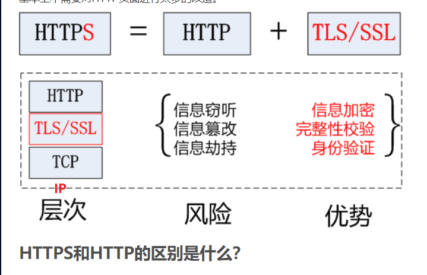

# HTTP

## 概念

HTTP被设计于20世纪90年代初期，是一种**可扩展的协议**。它是**应用层**的协议，通过[TCP](https://developer.mozilla.org/en-US/docs/Glossary/TCP)，或者是[TLS](https://developer.mozilla.org/en-US/docs/Glossary/TLS)－加密的TCP连接来发送，理论上任何可靠的传输协议都可以使用。

HTTP本质是无状态的，使用Cookies可以创建有状态的会话

HTTP依赖于面向连接的TCP进行消息传递，**但连接并不是必须的**。

在客户端（通常指浏览器）与服务器能够**交互**（客户端发起请求，服务器返回响应）之前，**必须**在这两者间**建立**一个 **TCP 链接**，打开一个 TCP 连接需要多次往返交换消息（因此耗时）。

HTTP/1.0 默认为每一对 HTTP 请求/响应都打开一个单独的 TCP 连接。当需要连续发起多个请求时，这种模式比多个请求共享同一个 TCP 链接更低效。

HTTP/2则发展得更远，通过在一个连接复用消息的方式来让这个连接始终保持为**暖连接**。 

## HTTP:C与S交互

打开TCP连接

发送HTTP报文

接受服务器发的HTTP报文

关闭TCP连接**或者后续请求重用连接。**

## MIME

> [Message Headers](https://www.iana.org/assignments/message-headers/message-headers.xhtml#perm-headers)
>
> [Complete list of MIME Types](https://developer.mozilla.org/zh-CN/docs/Web/HTTP/Basics_of_HTTP/MIME_types/Complete_list_of_MIME_types)

Accept 内的类型可以写多个，用“，”分割

Content-Type中的类型只能写一个。

> 可以当做固定格式：
>
> application/json;charset=utf-8

## Proxies

还有一部分是表现在应用层上的，被称为**代理（Proxies）**。代理（Proxies）既可以表现得透明，又可以不透明（“改变请求”会通过它们）。代理主要有如下几种作用：

- 缓存（可以是公开的也可以是私有的，像浏览器的缓存）
- 过滤（像反病毒扫描，家长控制...）
- 负载均衡（让多个服务器服务不同的请求）
- 认证（对不同资源进行权限管理）
- 日志记录（允许存储历史信息）

## HTTP 与Spring Boot

在请求中头定义了Conten-Type，在Spring 用 consumer对应解析

在请求中头定义了Accept，在Spring用producer对应

# HTTPS

## **作用**

（1）对数据进行加密，并建立一个信息安全通道，来保证传输过程中的数据安全;
（2）对网站服务器进行真实身份认证。

## **结构**

HTTPS是在安全的传输层上发送的HTTP

**HTTPS = HTTP + TLS/SSL**

## 建立安全传输

1. 在未加密HTTP中,客户端会打开一条到Web服务器端口80的TCP连接,发送一条请求报文,接收一条响报文,关闭连接

2. 在HTTPS中,客户端首先打开一条到Web服务器端口443的连接
3.  一旦建立了TCP连接(三次握手完成),客户端和服务器就会初始化SSL层(SSL握手),对加密参数进行沟通,并交换密钥
4.  SSL握手完成之后,SSL初始化就完成了,客户端就可以将请求报文发送给安全层， 在将报文发送给TCP之前,要先对其进行加密

